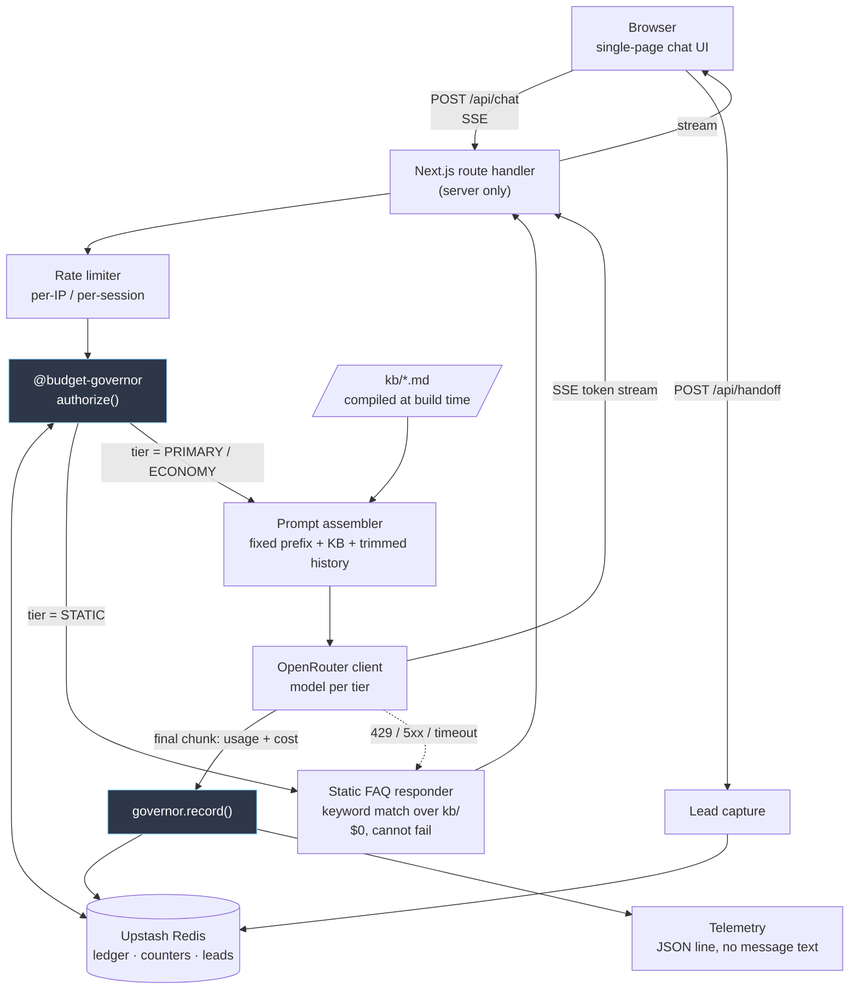

# Architecture

## 1. Scope

### IN — ships in the 5-hour build

| # | Item | Why it's in |
|---|---|---|
| 1 | Streaming chat UI, single page, mobile-usable | It's the deliverable; streaming is table stakes for perceived latency |
| 2 | Grounded answers over the curated `kb/` corpus, whole-KB-in-context | Covers 5 of the brief's 6 scenarios with one mechanism |
| 3 | Escalation + lead-capture form with honest promises | The brief's 6th scenario, and the product's actual value: knowing where the line is |
| 4 | `@budget-governor`: accounting, pacing, reserve, 3-tier degradation, rate limits, telemetry | The key must survive to review day; this is also the most interesting system-design surface |
| 5 | Deployed public URL on Vercel, live in Phase 2 | Deploy-early beats deploy-last |
| 6 | Governor + prompt-assembly unit tests with a mock LLM | Verification dimension, and $0 |
| 7 | Eval set run once against the real model under a $0.40 cap | Proof the thing works, bounded |
| 8 | Simulated-budget demo mode | Lets the review *see* the safety property |

### OUT — deliberately not built

| # | Item | Why not |
|---|---|---|
| 1 | Auth / user accounts | Public FAQ bot; auth adds a whole surface and answers no scenario |
| 2 | Real portal integration or account lookups | No such API is public; the honest answer is escalation |
| 3 | RAG / vector store | KB is 4,700 tokens. See `model-selection.md` §6 — RAG would cost more and ground worse |
| 4 | Conversation persistence across reloads | Requires identity and retention decisions; adds PII risk for near-zero value |
| 5 | Admin dashboard | Telemetry to logs + a JSON endpoint is enough to demo |
| 6 | Multi-language UI | Model answers in-language already; localising chrome is cosmetic |
| 7 | Live human handoff / chat routing | No verifiable channel exists. Faking one would be the worst possible dishonesty in a support bot |
| 8 | Streaming markdown rendering with rich cards | Plain text + links reads fine and costs an hour |
| 9 | Pricing answers of any kind | Not published, commercially binding. A permanent OUT, not a time constraint |

### LATER — right idea, wrong week

| # | Item | Trigger to revisit |
|---|---|---|
| 1 | RAG | KB > 25,000 tokens |
| 2 | Sliding-window rate limits | Real abuse observed |
| 3 | CRM webhook for leads (HubSpot/Salesforce) | A real endpoint + credentials exist |
| 4 | Per-topic answer-quality telemetry | After a week of real traffic |
| 5 | Semantic cache for repeated FAQs | Traffic > ~500 conversations/day |
| 6 | Multi-turn eval harness (conversations, not single turns) | Once single-turn evals are green and stable |
| 7 | Cross-session summarised memory | Only with a retention policy and a privacy notice |

### What the bot will never do
Quote prices · promise outcomes or ROI · opine on competitors · give legal, financial, tax
or HR advice · access, confirm or modify any customer account · emit an unverified URL ·
name Cadre staff or clients · state Cadre's security or compliance posture.
Full table with escalation mappings: `kb/09-boundaries.md`.

## 2. Stack

**Next.js 15 (App Router) + TypeScript on Vercel**, Node runtime, SSE streaming.
Upstash Redis (Vercel Marketplace) for the governor ledger and leads. Tailwind for the UI.
Vitest for tests.

Chosen because it is the fastest path from zero to a public HTTPS URL with streaming, it is
the brief's own suggested default, and — the decisive reason — **Vercel's environment-variable
store is the only place the OpenRouter key ever lives.** Server-only route handler, key read
from `process.env` inside the handler, never in a `NEXT_PUBLIC_*` name, never in the bundle,
never in the repo, never in a log line.

Redis rather than in-process state because serverless instances do not share memory: a
per-instance counter under-counts spend by exactly the concurrency factor, which defeats the
entire ceiling. It is the simplest store that is *correct*, which is a different question
from the simplest store.

## 3. Diagram



## 4. API

### `POST /api/chat`
Request:
```ts
{ sessionId: string;            // uuid v4, client-generated, kept in sessionStorage
  message: string;              // ≤ 2000 chars, rejected above
  history: { role: 'user'|'assistant'; content: string }[]; // ≤ 12 entries, server re-trims
}
```
Response: `text/event-stream`, `Transfer-Encoding: chunked`.

```
event: meta
data: {"tier":"PRIMARY","model":"google/gemini-3.8-flash","simulated":false}

event: token
data: {"t":"Cadre AI is an AI strategy"}

event: done
data: {"escalate":false,"latencyMs":1340,"tier":"PRIMARY"}
```

- `meta` is always first, so the UI can badge the tier before any text arrives.
- `event: error` is **never** sent for a budget, rate-limit or upstream failure — those
  degrade to `STATIC` and stream normally with `tier:"STATIC"`. `error` is reserved for
  malformed input, and even then the UI shows a human sentence.
- `done.escalate = true` tells the UI to surface the handoff form inline.

| Status | When | Body |
|---|---|---|
| 200 | always, including degraded and rate-limited | SSE stream |
| 400 | message empty / > 2000 chars / malformed JSON | `{code:'bad_request', message}` |
| 413 | history payload > 32 KB | `{code:'payload_too_large', message}` |
| 500 | genuine unexpected server fault | `{code:'internal', message}` — a sentence, never a stack |

429 is deliberately **absent**: a throttled user gets a real, useful static answer (200)
rather than a red error. The `retryAfterSec` rides in the `meta` event.

### `POST /api/handoff`
```ts
// request
{ sessionId: string; name?: string; email?: string; company?: string;
  topic: string; urgency: 'general'|'active_project'|'existing_client' }
// response 200
{ ok: true; reference: string }   // short opaque id, so the user has something to quote
```
Validates that at least one contact method is present. Rate limited at 3/session/hour.
Returns `{ok:true}` and a reference — and the UI copy says exactly what that means: stored
for the team, no promised response time.

### `GET /api/health`
`{ ok, tier, spentUsdLifetime, daysRemaining, simulated }` — no secrets, no PII. Used by
`/deploy-check` and for the demo.

## 5. Data model

Three keys in Redis. That is the entire persistence layer.

| Key | Type | TTL | Contents |
|---|---|---|---|
| `gov:spend:lifetime` | float (INCRBYFLOAT) | none | cumulative USD |
| `gov:spend:day:{YYYY-MM-DD}` | float | 8 days | USD spent that day |
| `gov:rl:{scope}:{hash}:{window}` | int | window | fixed-window counter |
| `gov:telemetry` | list, capped 1000 | none | one JSON row per call (§8 of governor spec) |
| `leads:{ulid}` | hash | 30 days | name, email, company, topic, urgency, ts |

**Not persisted, on purpose:**
- Conversation transcripts. History lives in the browser's `sessionStorage` and in the
  request body; the server never writes it anywhere. The bot cannot leak what it never
  stored, and nothing in the codebase has a place to put it.
- IP addresses. Rate-limit keys store `HMAC(ip, salt)`, never the address.
- Any user text in telemetry — structurally impossible, see governor spec §8.

Leads are the one place PII is stored, because the user deliberately typed it and asked for
it to be passed on. 30-day TTL, minimal fields, no tracking identifiers, and the UI says so
before the user types.

## 6. Separation of concerns

```
kb/*.md                     ← facts + sources. Editable by a non-engineer.
lib/kb/compile.ts           ← build-time: strip Sources:/[V:] tags, assert every
                              bullet has a source, emit kb.generated.ts + faq.generated.ts
lib/prompt/assemble.ts      ← fixed prefix + <knowledge_base> + trimmed history.
                              Pure function. Snapshot-tested. Never calls anything.
lib/governor/**             ← money, time, tiers. Zero domain knowledge. Zero I/O
                              except through the LedgerStore port.
lib/llm/openrouter.ts       ← the only file that knows OpenRouter exists. Returns a
                              token stream + a normalised CallUsage. Swappable.
app/api/**                  ← thin. Orchestrates the four above. No business logic.
app/(ui)/**                 ← presentation. Never sees a model name except via `meta`.
```

The test of this layering: **swapping OpenRouter for a direct Anthropic client should touch
exactly one file.** Changing a Cadre fact should touch exactly one `kb/*.md`. Changing the
budget should touch exactly one config object.

## 7. Scaling

**Today (~10–50 conversations/day, demo URL).** Everything above is oversized for this and
that is fine; the governor exists for the tail risk, not the mean.

**At 100 conversations/day (~$1.35/day at PRIMARY).**
Nothing structural changes. The $5 key is the binding constraint, not the architecture —
you would move to a funded key and raise `totalBudgetUsd`. Add a semantic cache for the
~30% of questions that are literally "what does Cadre do", which cuts spend roughly a third
for an hour of work. Per-IP daily cap probably needs raising off 120.

**At 10,000 conversations/day (~$135/day).**
Now things actually change:
- **Ledger contention.** `INCRBYFLOAT` on one key at ~7 writes/sec is still fine, but the
  read-before-authorize becomes the hot path. Move to a per-instance token-bucket that
  leases budget in $0.50 chunks from Redis, reconciling every 30 s — amortises the round
  trip and keeps the fail-closed property at the lease level.
- **Rate limiting** moves to the edge (Vercel Edge Middleware / Cloudflare) so abusive
  traffic never reaches a function invocation. Fixed windows become sliding.
- **Caching earns its keep**: a semantic cache on normalised questions plausibly serves
  40–60% of traffic at near-zero cost. Prompt caching stops being incidental upside and
  becomes worth engineering for — batch warm the prefix.
- **KB grows** past what belongs in every request. *This* is where RAG becomes correct:
  route to 2–3 topic files, keep the boundaries/escalation block always-resident so
  refusals never degrade.
- **Telemetry** leaves Redis for a real sink (ClickHouse / Tinybird); a capped list is a
  demo affordance, not a datastore.
- **Leads** go to a queue with a CRM consumer and a dead-letter path, because at that volume
  a dropped lead is revenue.
- **Human handoff** becomes real — routing to a live channel with hours and an SLA — which
  in turn changes the honest copy in `kb/08`. That is a product change, not just infra.

What does *not* change at any scale: the KB is the only source of facts, the governor fails
closed, and no transcript is stored.
